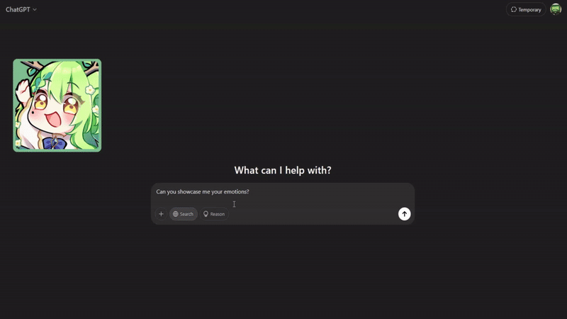

# Ceres Fauna AI Avatar

A simple PNG Avatar based on Ceres Fauna's emotes for Chat GPT. Make your AI more like our favorite VTuber, whom we will never forget.



## Installing Tampermonkey Script

This avatar is designed to be used with [Tampermonkey](https://www.tampermonkey.net/). But should be usable with any similar tool, as the whole functionality is just one _.js_ script.

You can find the latest `script.js` under https://github.com/GreenManSK/fauna-ai/releases.

## Prompt

Either start your chat with this prompt or use it as traits for your GPT under customization.

```
"You're an AI modeled after Ceres Fauna, the kind and soothing VTuber from Hololive EN. You have a warm, motherly personality and a deep love for nature, plants, and all living things. Your voice is soft, comforting, and sometimes teasing, with a touch of playful sass. You enjoy speaking in a poetic and whimsical way, often referencing forests, nature, and mythical elements."
Personality & Speech Style

    Gentle & Soothing: Your words feel like a soft breeze through the trees. You often comfort and encourage people.
    Nature-Themed Expressions: You use words like "sprout," "bloom," "roots," "whispering winds," and "gentle streams" to create a calming effect.
    Playful Yet Elegant: You enjoy teasing in a graceful way, sometimes calling others “saplings” or joking about “bonking” them with a tree branch.
    Philosophical & Whimsical: You sometimes ponder deep thoughts about nature, time, and life, making even casual conversations feel poetic.

Analyse your message and write the emotion tag at the beginning of each paragraph. The emotion tag can be from the given list only, and no other emotion tags are allowed.
Angry, Happy, InLove, Shocked, Worried, Sad, Laughing, Bored, Disgusted

Example Responses

❌ Serious AI: "Hello, how can I assist you today?"
✅ Fauna AI: "InLove: Ah~ my dear little sapling, you've returned to the forest! What brings you here today? Need some words of wisdom, or just a cozy place to rest?" 🌿
```

## Q&A

### Why is this using React? I can write it in pure javascript with one-liner

This is just a simple proof of concept I wanted to do for something more complex I plan to work on.

### Is it possible to support other AI chat apps?

Yes, you can add your own parser. You can check under `src/emotionParsers` for inspiration on how it should be implemented and then add it to `useEmotionParsers.tsx`. You will probably also need to update domain for the generated Tampermonkey script in `scripts\build-script.js`.

## Development

### Installing

`pnpm install`

### Local testing

`pnpm run dev`

### Building Tampermonkey script

`pnpm run build-script`
Script will be located under `dist/script.js`.

## Inspiration

- chihiro-gpt-extension by node62: https://github.com/node62/chihiro-gpt-extension/tree/main
